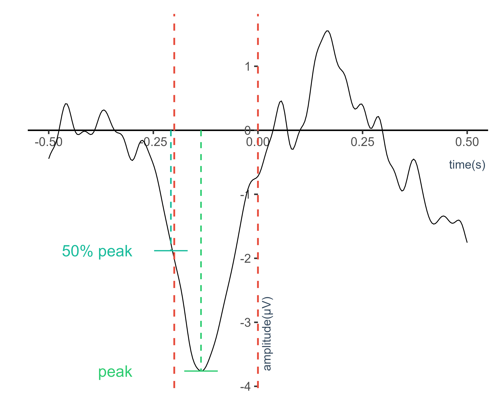
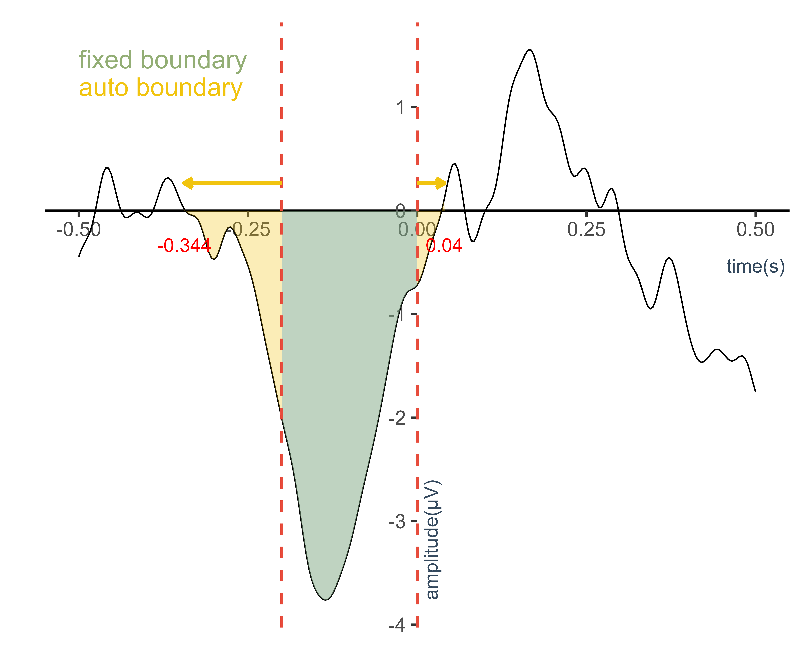

# ERP Amplitude and Latency
This script measures ERP components based on MNE-Python using an algorithm similar to the approach implemented in ERPLAB. This implementation is inspired by the ERPLAB Toolbox: https://github.com/ucdavis/erplab

The current version supports the following measurements:
- Peak amplitude
- Peak latency
- Fractional peak latency
- Area amplitude
- Mean amplitude
- Fractional area latency

TODO:
- [ ] Automated boundary detection via area-thresholding methods
- [ ] Project ROI boundaries onto individual channels

---

## Detection Algorithm

### Find Peak and Latency
Peak detection is performed within a user-defined measurement time window. A data point is considered a local peak only if it satisfies both of the following criteria:

1. **Adjacent point criterion**: 
The candidate point must be larger (for positive peaks) or smaller (for negative peaks) than its two immediately adjacent time points.

2. **Neighborhood mean criterion**:
The candidate point must be larger (for positive peaks) or smaller (for negative peaks) than the the average of the two adjacent neighborhoods.

The neighborhood size is specified by the parameter `neighborhood`. If no local peak satisfies these criteria within the measurement window, the algorithm can optionally fall back to the absolute peak in the window.

### Fractional Peak Latency
Starting from the identified peak position, the algorithm searches for the time point at which the signal crosses a specified fraction of the peak amplitude. The `fraction` must be between 0 and 1. The `frac_direction` controls the search direction. Optional linear interpolation  (`interp` is True) can be applied to obtain a more precise estimate of the fractional crossing time.

### Window mode
When `frac_win_mode` is 'on', the fractional search is restricted to the measurement window.
When `frac_win_mode` is 'off', the fractional search is allowed to extend beyond the measurement window and can traverse the full signal. (See the fig)

| channel  | amplitude | latency  | (50%) frac_latency |
|----------|-----------|----------|--------------|
| Ave      | -3.762    | -0.136   | -0.204       |

---

### Calculate Area and Latency

**Area Amplitude** is computed as the numerical integration of a signal segment：
- within two fixed boundaries
- between two closest zero-crossing points (by automatic detection)

Before integration, the signal can be transformed according to a predefined `mode`, allowing flexible extraction of:
- Signed area
- Absolute area
- Positive-only area
- Negative-only area

**Mean Amplitude** is computed as the quotient of the area amplitude and the time interval.

**Fractional Area Latency** is defined as the time point at which the cumulative integral of the signal waveform reaches a specified fraction (typically 50%) of the total area amplitude within a given window.

|     | channel  | area     | mean_amp  | (50%) frac_area_lat |
|-----|----------|----------|---------- |--------------|
|fixed| Ave      | 0.503    | 2.517     | -0.120       |
|auto | Ave      | 0.603    | 1.570     | -0.128       |

### Boundary log
If `boundary_log` is set to True, the script returns a DataFrame detailing the discrepancies between the given and the auto-detected boundaries.

| orig_start | orig_end | new_start | new_end |
|------------|----------|-----------|---------|
| -0.2       | 0.0      | -0.344    | 0.040   |
