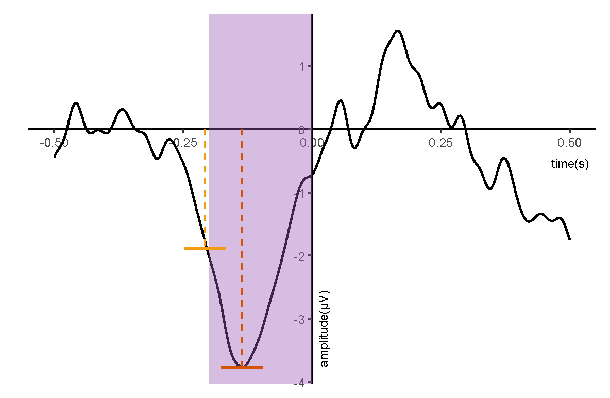

# ERP Peak and Latency
This script measures ERP components using an algorithm similar to the approach implemented in ERPLAB. This implementation is inspired by the ERPLAB Toolbox: https://github.com/ucdavis/erplab

The current version supports the following measurements:
- Peak amplitude
- Peak latency
- Fractional peak latency

TODO:
- [ ] Mean amplitude
- [ ] Area amplitude
- [ ] Fractional area latency

# Detection Algorithm

## Find Peak and Latency
Peak detection is performed within a user-defined measurement time window. A data point is considered a local peak only if it satisfies both of the following criteria:

1. **Adjacent point criterion**: 
The candidate point must be larger (for positive peaks) or smaller (for negative peaks) than its two immediately adjacent time points.

2. **Neighborhood mean criterion**:
The candidate point must be larger (for positive peaks) or smaller (for negative peaks) than the the average of the two adjacent neighborhood.

The neighborhood size is specified by the parameter `neighborhood`. If no local peak satisfies these criteria within the measurement window, the algorithm can optionally fall back to the absolute peak in the window.

## Fractional Latency
Starting from the identified peak position, the algorithm searches for the time point at which the signal crosses a specified fraction of the peak amplitude. The `fraction` must be between 0 and 1. The `frac_direction` controls the searching direction. Optional linear interpolation  (`interp` is True) can be applied to obtain a more precise estimate of the fractional crossing time.

### Window mode
When `frac_win_mode` is 'on', the fractional search is restricted to the measurement window.
When `frac_win_mode` is 'off', the fractional search is allowed to extend beyond the measurement window and can traverse the full signal. (See the fig)

| channel  | amplitude | latency  | (50%) frac_latency |
|----------|-----------|----------|--------------|
| Ave      | -3.762    | -0.136   | -0.208       |
